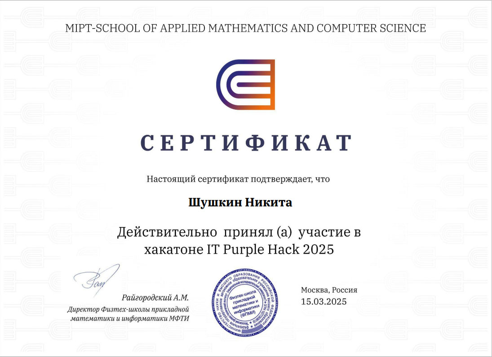

#  Привет, я Никита👋
- Это мой профиль, где я делюсь своими проектами и достижениями. Надеюсь, найдёшь что-то интересное для себя. Приятного просмотра!

## 🚀 Обо мне
- **Нахожусь:** Москва, Россия
- **Студент:** Второй курс НИТУ МИСиС
- **Направление:** ИВТ (Информатика и вычислительная техника)

## 🛠 Технический стек
### 🌌 Языки программирования

### 💾 Базы данных

### 🔧 Инструменты

## 🔭  Проекты

- [HackT1](https://github.com/nikita89756/hackT1) - Репозиторий, в котором была решина задача по созданию умного ассистента для хакатона T1.
- [Tgbot](https://github.com/nikita89756/Tgbot) - Репозиторий с телграм ботом, написанным на Golang.
- [Algoritms](https://github.com/nikita89756/Algoritms) - Репозиторий с алгоритмическими задачами
- [kitg](https://github.com/nikita89756/kitg) - Репозиторий задач по комбиноторике
- [patterns](https://github.com/nikita89756/patterns) - Репозиторий с имплементацией различных паттернов.
- [AvitoAdmin](https://github.com/nikita89756/AvitoAdmin) - Репозиторий с хакатона IT-Purple 2024.

## 🌟  Достижения

  

## 🔗 Links

